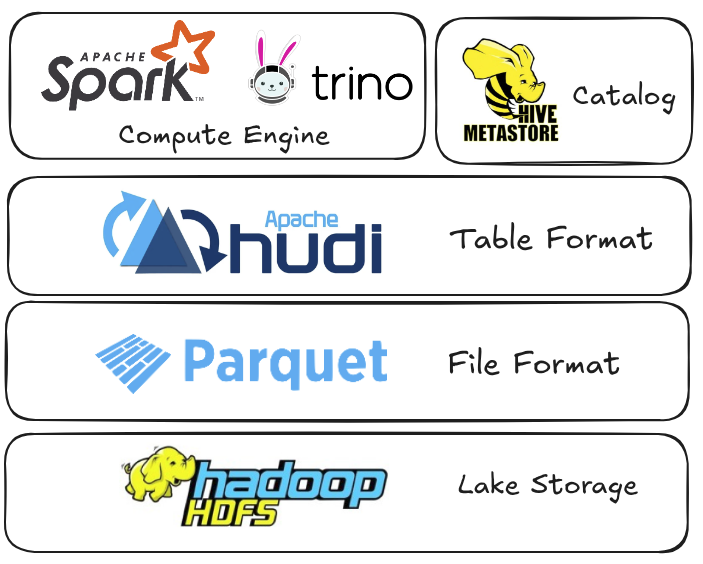

# Data LakeHouse với Apache Hudi
Xây dựng Data LakeHouse đơn giản với các công nghệ:
- Hadoop Distributed File System (HDFS)
- Hive Metastore
- Apache Hudi
- Apache Spark
- Presto/Trino
- Docker

Sử dụng DBeaver để thao tác trực quan với Trino và Presto.
## Kiến trúc

## Cài đặt và chạy
Khởi động các Docker Container:

```bash
docker compose up -d
```
Tạo các thư mục trên HDFS:
```bash
hdfs dfs -mkdir -p /data
hdfs dfs -mkdir -p /data/ebs /data/sip_invite /data/hudi /data/cell_detect
```
Chuyển dữ liệu từ local vào container HDFS-NameNode:

```bash
docker cp ./sample_data/ebs.parquet namenode:/data/ebs.parquet
docker cp ./sample_data/sip_invite.parquet namenode:/data/sip_invite.parquet
```
Chuyển dữ liệu về đúng vị trí các thư mục trong Namenode:
```bash
docker exec -it namenode bash
hdfs dfs -put /data/ebs.parquet /data/ebs/ebs.parquet
hdfs dfs -put /data/sip_invite.parquet /data/sip_invite/sip_invite.parquet
```
Kiểm tra lại trên NameNode UI:  

```localhost:9870```

### Chuẩn bị dữ liệu trong Data Lake
- Sử dụng file ebs.parquet

Đối với Data Lake, sử dụng Compute Engine là Presto để tương tác với HDFS, Hive Metastore. 

Không sử dụng Apache Hudi.

Trong DBeaver, tạo connection với container Presto tại ```localhost:8083``` và username là ```presto```

Thực thi câu lệnh: 

```bash
CREATE TABLE hive.default.ebs (
   event_id varchar,
   msisdn varchar,
   imsi bigint,
   eci bigint,
   event_time bigint,
   date_hour varchar
)
WITH (
   format = 'PARQUET',
   external_location = 'hdfs://namenode:9000/data/ebs'
);
```
Kiểm tra dữ liệu trong bảng:
```bash
SELECT * FROM hive."default".ebs
```
### Chuẩn bị dữ liệu trong Data LakeHouse
- Sử dụng file sip_invite.parquet

Với Data LakeHouse, sử dụng Trino làm Compute Engine.

Open Table Format là Apache Hudi.

Trong DBeaver, tạo connection với container Trino tại ```localhost:8082``` và username là ```trino```

Dữ liệu trên Data Lakehouse với Apache Hudi sẽ được tạo bằng cách submit Spark job tại `./airflow/jobs/test1/src/main/scala/WriteHudi.scala`:
- Truy cập CLI của container Spark Master:

    ```docker exec -it spark-master bash```
- Submit Job:
    ```
    spark-submit --class org.test.app.WriteHudi ./spark_jars/scala-2.12/test1_2.12-0.1.0-SNAPSHOT.jar
    ```
Kiểm tra dữ liệu trong LakeHouse thông qua Trino (sử dụng DBeaver): 
```bash
SELECT * FROM hive."default".ebs
```
### Luồng xử lý dữ liệu
- Đọc dữ liệu trong bảng `hive.default.ebs` trong **Data Lake** thông qua Presto (JDBC)
- Đọc dữ liệu trong bảng `hudi.default.sip_invite` trong **Data Lakehouse** thông qua Trino (JDBC)
- Thực hiện các phép Transformation trên dữ liệu của hai bảng trên
- Lưu kết quả vào **Data Lakehouse** với Open Table Format là **Apache Hudi**.

Chi tiết của luồng xử lý dữ liệu tại: `Pipeline_01_opt.scala` và `Pipeline_02_opt.scala` trong thư mục `./airflow/jobs/test1/src/main/scala`. Cả 2 file thực hiện nhiệm vụ giống nhau, chỉ khác nhau ở các phép Transformation. 

Thực hiện Submit Spark Job:
```bash
spark-submit --class org.test.app.Pipeline_01_opt ./spark_jars/scala-2.12/test1_2.12-0.1.0-SNAPSHOT.jar
```
```bash
spark-submit –class org.test.app.Pipeline_02_opt ./spark_jars/scala-2.12/test1_2.12-0.1.0-SNAPSHOT.jar
```

Kiểm tra kết quả ghi dữ liệu:
- Qua DBeaver (Trino):
    ```bash
    select * from hudi."default".cell_detect_01 ;
    select * from hudi."default".cell_detect_02 ;
    ```
- Qua Web UI của HDFS NameNode: Thư mục `/data/cell_detect`

Các gói cần thiết được liệt kê tại `spark.jars.packages` tại `./spark/conf/spark-defaults.conf`
và `build.sbt`
